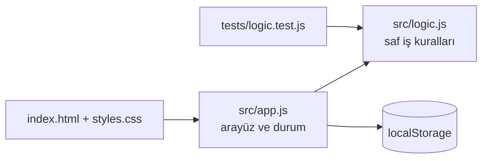

# Kanban Pano

[](https://github.com/ahmetbolukoglu/kanban-pano/actions/workflows/appnar.yml)
[](https://ahmetbolukoglu.github.io/kanban-pano/)


> İş akışınızı görselleştirin, önceliklendirin ve hedeflerinize zamanında ulaşın.

**Canlı demo:** https://ahmetbolukoglu.github.io/kanban-pano/

Kanban Pano; bireylerin ve ekiplerin günlük iş akışlarını karmaşadan uzak, sezgisel ve hızlı bir şekilde görselleştirmesini sağlayan modern bir üretkenlik aracıdır. Son tarih takibi, akıllı filtreleme ve günlük gündem şablonları sayesinde yapılacak işlerinizi unutmanızı engeller ve odaklanmanızı artırır; yoğun tempolu çalışanlar, öğrenciler ve kişisel görevlerini düzenlemek isteyen herkes için idealdir.

## Özellikler
- 📋 Yapılacak, Sürüyor ve Bitti sütunları arasında kesintisiz sürükle-bırak deneyimi
- 🏷️ Renkli etiketler ve 4 farklı öncelik seviyesi (Düşük, Orta, Yüksek, Acil)
- ⏰ Yaklaşan ve geciken son tarihler için akıllı görsel uyarılar ve sesli bildirimler
- 🔍 Metin, öncelik, etiket ve gecikme durumuna göre anlık arama ve filtreleme
- ⚡ Tek tıkla profesyonel iş planı oluşturan hazır "Günlük Gündem" şablonu
- 📊 Günlük ve haftalık tamamlanma oranlarını sunan verimlilik istatistikleri
- 💾 Verilerinizi güvenle yedeklemenizi sağlayan JSON dışa ve içe aktarma desteği

## Nasıl çalışır



## Yerelde çalıştır

```bash
git clone https://github.com/ahmetbolukoglu/kanban-pano.git
cd kanban-pano
npx serve .        # veya herhangi bir statik sunucu
npm test
```

Bağımlılık yok: düz HTML, CSS ve JavaScript modülleri.

## Proje yapısı

```
index.html          sayfa iskeleti
styles.css          tasarım, açık/koyu tema
src/app.js          arayüz ve kalıcı durum
src/logic.js        saf fonksiyonlar (test edilir)
tests/              node:test birim testleri
docs/PLAN.md        ürün planı
```

## Lisans

MIT © 2026 ahmetbolukoglu

---
<sub>Bu repo [AppNar](https://github.com/topics/appnar) ile üretildi.</sub>
